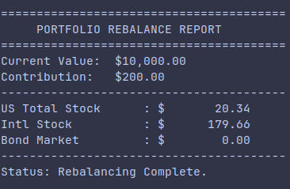

# Portfolio Rebalancer CLI

A CLI tool designed to help investors maintain their target asset allocation through contribution-only rebalancing.



## Motivation
I used to manage my rebalancing in a spreadsheet, but Excel has limits. I ported the logic to this CLI tool to achieve:

- **Immutable Logic:** No more accidental formula breaks or errors.
- **Testability:** Every calculation is verified by a test suite.
- **Workflow Efficiency** Faster execution and a base for future automation.

## Built with Gemini CLI
This project was developed using **Gemini CLI**, an AI-powered code assistant. I used modern AI workflows for scaffolding, architectural designs, and test generation.

## Features
- **Tax-Efficient Rebalancing:** Logic prioritizes adding to underweight assets rather than selling overweight ones.
- **Proportional Scaling:** Intelligently handles contributions that are too small to fill all gaps perfectly.
- **Modern Python:** Developed with Type Hints, Dataclasses, and a modular package structure.

## Quick Start

**Prerequisites:** Python 3.10+

```bash
# Clone and install
git clone https://github.com/aaronCruise/Portfolio-Rebalancer.git
cd Portfolio-Rebalancer
pip install -r requirements.txt

# Run the rebalancer
python3 -m rebalancer.main --contribution <dollar amount>
```

## Engineering Quality
- **Test Suite:** Run `pytest` to see the logic verification.
- **Architecture:** Decoupled `models.py` (data), `engine.py` (math), and `main.py` (CLI).
- **Validation:** Built-in checks to ensure allocations always sum to 100%.

---
*Created as part of my post-grad portfolio to demonstrate clean code, test-driven development, and AI-assisted engineering.*
