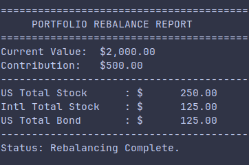

# Portfolio Rebalancer

A CLI tool designed to help investors maintain their target asset allocation through contribution-only rebalancing.

<p align="center">
  
</p>

This project was built using **Gemini CLI** to explore AI-driven development for architectural designs, scaffolding, and code generation.

## Motivation
I originally managed my investments and rebalancing through a spreadsheet. I ported the logic to a CLI tool to achieve:
- Workflow efficiency. Faster execution and a foundation for future automation.
- Version control. My investment strategy and portfolio can now be tracked with Git.
- Reliability. All logic lies within modules that are invisible to the user. No more accidental formula breaks!

## Features
- Tax-efficient logic. Prioritizes buying underweight assets, never selling.
- JSON portfolios. Load your custom portfolio from a simple `json` file.
- Proportional scaling. Handles contributions that are too small to fill all gaps perfectly.
- Modern Python. Built with type hints, dataclasses, and a modular package structure.

## Usage 
**Prerequisites:** Python 3.10+

1.  Install and Setup.
    ```bash
    git clone https://github.com/aaronCruise/Portfolio-Rebalancer.git
    cd Portfolio-Rebalancer
    
    # Install the package locally in editable mode
    pip install -e .
    ```

2.  Configure your portfolio.
    The `portfolio.json` provided in this repository serves as a template. To use the tool, ensure a `portfolio.json` exists in your **current working directory**:

    ```json
    {
      "assets": [
        {
          "name": "Total Stock Market",
          "target_allocation": 0.60,
          "current_balance": 6000.00
        },
        ...
      ]
    }
    ```

3. Run it.
    *   **Default Mode** (looks for `portfolio.json` in current folder):
        ```bash
        rebalance --contribution 1000
        ```

    *   **Custom File Mode**:
        ```bash
        rebalance --contribution 1000 --file my_portfolio.json
        ```

## Running Tests
The core logic is verified with `pytest`. To run the tests:
```bash
pytest
```
